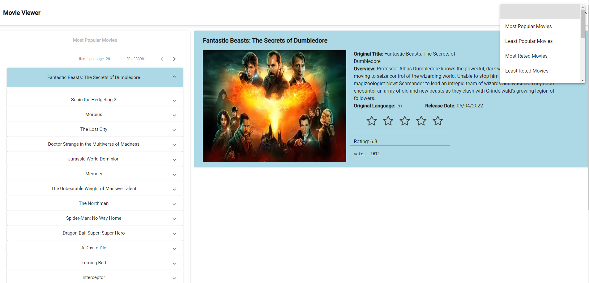

# The MovieDatabaseUiClient
A Client for [The Movie Database] RESTful API. 

Using this client and via the Movie Database API you can access a list of movies and sort them in different ways. Also, you can see the details and ratings for each movie.  

## How to Build it
Open the project using Microsoft Visual Studio and build the app on DEBUG mode using the `MovieViewer` profile. This preconfigured profile builds the [.Net Core 6] app and the [Angular] app on your localhost and on ports:
* 7198 for the [.Net Core 6] app 
* 43754 for the [Angular] app

## Functionality 
After a successful build, the Browser will pop-up and you will see a loading page from [SPA proxy]. SPA proxy will redirect calls from the [Angular] app to the [.Net Core 6] app and back.

The [Angular] app wil be responsible to create the view for the WebApplication and the functionality on that page. The [.Net Core 6] app wil be responsible to serve that [Angular] app to the specified path and listen to the HTTP calls from the [Angular] app. SPA Proxy will handle the communication between the [.Net Core 6] app and the [Angular] app.

## UI Screenshots

## Created With 
- [AngularJS] For designing the WebApp 
- [TypeScript] Utilised by AngularJS 
- [Bootstrap] Used to do the  WebApp responsive
- [Material] Frontend Framework Components 
- [.Net Core 6] for the back end of the WebApp
- [SPA proxy] to redirect HTTP calls through the applications

[The Movie Database]: <https://developers.themoviedb.org/3/getting-started/introduction>
[Angular]: <https://angular.io/>
[AngularJS]: <http://angularjs.org>
[.Net Core 6]: <https://docs.microsoft.com/el-gr/dotnet/>
[TypeScript]: <https://www.typescriptlang.org/>
[Bootstrap]: <https://getbootstrap.com/>
[Material]: <https://material.angular.io/>
[SPA proxy]: <https://docs.microsoft.com/en-us/archive/msdn-magazine/2013/november/asp-net-single-page-applications-build-modern-responsive-web-apps-with-asp-net>